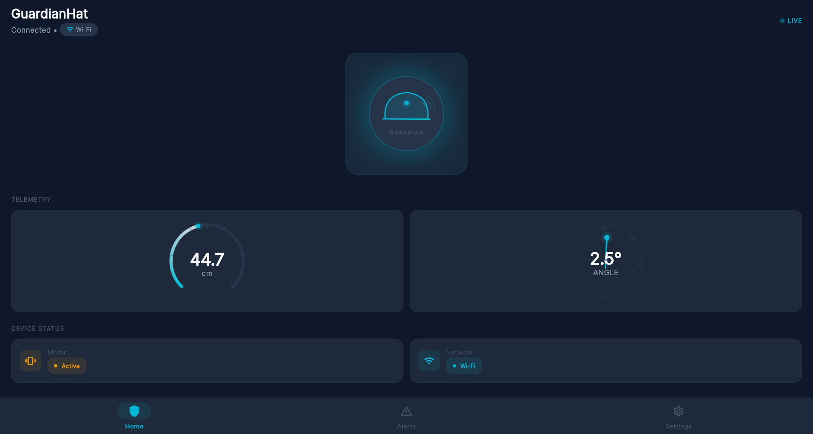
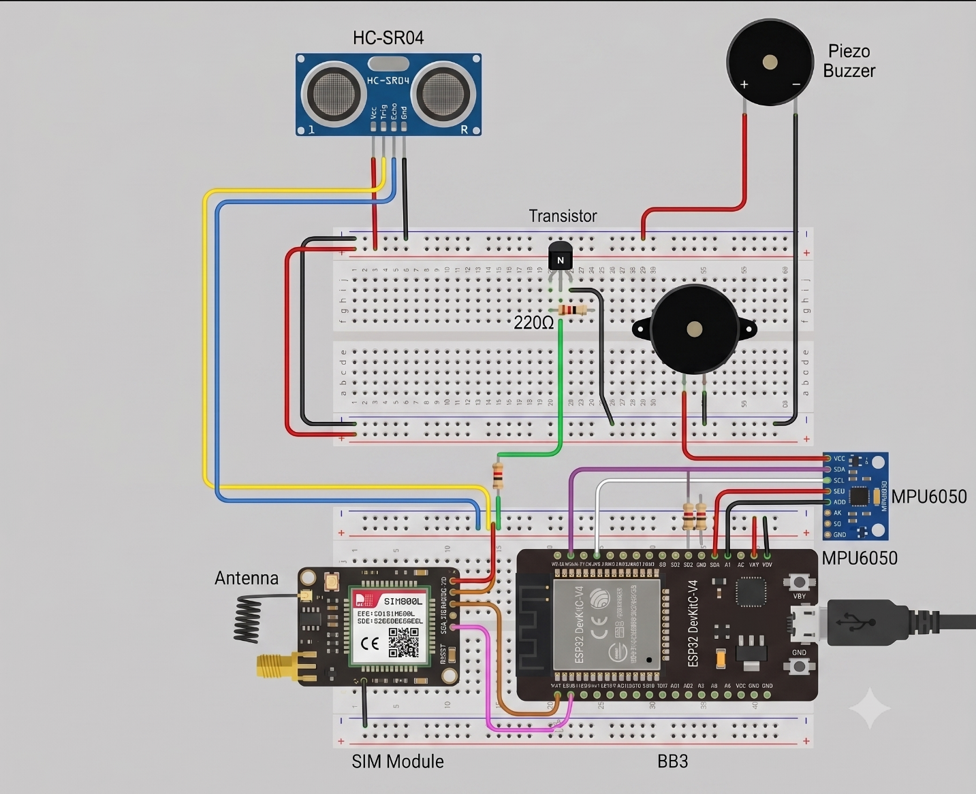
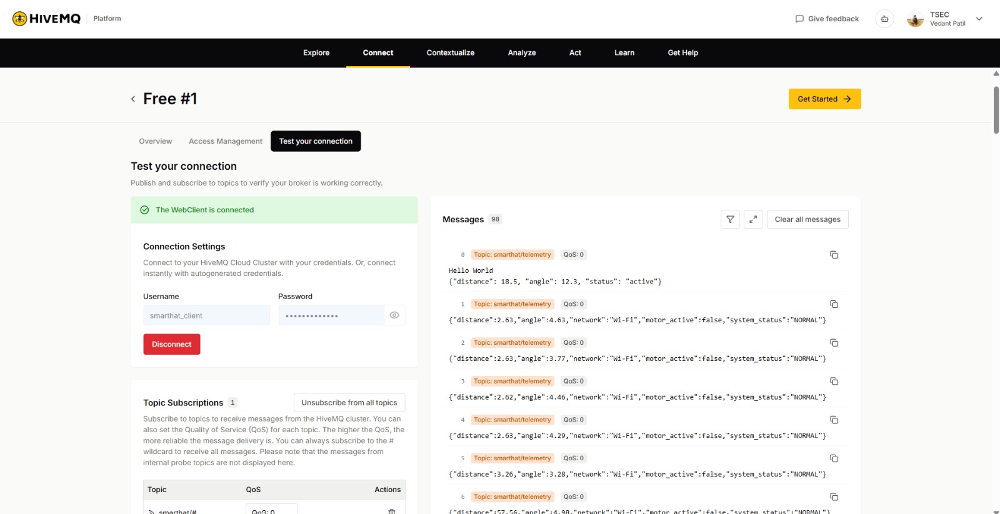

# 🛡️ GuardianHat IoT — Smart Safety Helmet Ecosystem

[](https://flutter.dev)
[](https://www.espressif.com)
[](https://www.hivemq.com)
[](https://www.twilio.com)
[](LICENSE)

An IoT-enabled smart safety helmet ecosystem designed for industrial workers, motorcyclists, and high-risk field personnel. **GuardianHat** combines real-time obstacle proximity warnings, sudden-fall detection, multi-tier emergency SMS dispatch (Cloud API + Cellular Fallback), and a companion Flutter app powered by HiveMQ Cloud MQTT.

---

<p align="center">
  
</p>

---

## 🌟 Key Features

- **Proximity Obstacle Detection & Haptic Warning**:
  - Ultrasonic sensor measures distance in real time ($5\text{ cm} - 55\text{ cm}$).
  - Non-blocking proportional vibration pulse warning speeds up as obstacles get closer.
- **Delta Fall & Impact Detection**:
  - MPU-6050 6-axis accelerometer & gyroscope calculates head inclination angles.
  - Detects sudden angular jerks ($\Delta > 50^\circ$ within $1\text{s}$), eliminating false positives from slow, deliberate head tilts.
- **Dual-Channel Emergency Dispatch Protocol**:
  - **Primary**: Twilio Cloud REST API over Wi-Fi with GPS location maps link.
  - **Secondary (Hardware Fallback)**: Direct SIM800L GSM cellular SMS via AT commands if Wi-Fi is unavailable or drops.
- **Real-Time Cloud Telemetry**:
  - Secure TLS MQTT telemetry publishing to HiveMQ Cloud every second.
- **Instrument-Grade Companion Mobile App**:
  - Real-time dark glassmorphism dashboard built with Flutter & Riverpod.
  - Real-time tilt visualizer, arc distance gauge, live motor/network status pills.
  - 10-second hardware watchdog timer with automatic offline reset.
  - Full-screen emergency fall alert overlay with one-tap Google Maps emergency coordinates.

---

## 🏗️ System Architecture & Data Flow

```
┌────────────────────────────────────────────────────────────────────────┐
│                        GUARDIAN HAT HARDWARE                           │
│  [HC-SR04] Ultrasonic     [MPU-6050] Gyro/Accel     [Vibration Motor]  │
│        │                          │                        ▲           │
│        ▼                          ▼                        │           │
│  ┌──────────────────────────────────────────────────────────────┐      │
│  │                    ESP32 Microcontroller                     │      │
│  └────────────────┬─────────────────────────────┬───────────────┘      │
│                   │ (Wi-Fi TLS)                 │ (SIM800L GSM)        │
└───────────────────┼─────────────────────────────┼──────────────────────┘
                    ▼                             ▼
        ┌───────────────────────┐     ┌───────────────────────┐
        │  HiveMQ Cloud Broker  │     │   Cellular Carrier    │
        │ (smarthat/telemetry)  │     │   (Fallback SMS)      │
        │   (smarthat/alerts)   │     └───────────┬───────────┘
        └───────────┬───────────┘                 │
                    │ (WSS / TLS)                 ▼
                    ▼                   ┌───────────────────┐
        ┌───────────────────────┐       │ Emergency Contact │
        │  Flutter Mobile App   │       │     Phone SMS     │
        │ (Real-Time Dashboard) │       └───────────────────┘
        └───────────────────────┘
```

---

## 🔌 Hardware Circuit & Wiring

<p align="center">
  
</p>

### Pin Assignment Table

| Component | ESP32 Pin | Interface / Role |
| :--- | :--- | :--- |
| **HC-SR04 (Trig)** | `GPIO 32` | Ultrasonic Trigger Output |
| **HC-SR04 (Echo)** | `GPIO 35` | Ultrasonic Echo Input |
| **Vibration Motor** | `GPIO 26` | PWM / Digital Haptic Output |
| **MPU-6050 (SDA)** | `GPIO 21` | I2C Data (Wire default) |
| **MPU-6050 (SCL)** | `GPIO 22` | I2C Clock (Wire default) |
| **SIM800L (TX)** | `GPIO 16` | HardwareSerial RX2 |
| **SIM800L (RX)** | `GPIO 17` | HardwareSerial TX2 |

---

## ☁️ Cloud & MQTT Broker Architecture

<p align="center">
  
</p>

### MQTT Topics & Payloads

#### 1. Telemetry Topic: `smarthat/telemetry`
Published every 1 second by the ESP32:
```json
{
  "distance": 24.50,
  "angle": 12.30,
  "network": "Wi-Fi",
  "motor_active": false,
  "system_status": "NORMAL"
}
```

#### 2. Emergency Alerts Topic: `smarthat/alerts`
Published with highest priority immediately upon fall detection:
```json
{
  "event": "FALL_DETECTED",
  "previous_angle": 12.30,
  "current_angle": 74.80,
  "delta": 62.50,
  "maps_url": "http://maps.google.com/?q=19.064500,72.835800"
}
```

---

## 📁 Repository Structure

```text
GuardianHat-IoT/
├── assets/
│   ├── AppVisual.png          # Mobile dashboard screenshot & visuals
│   ├── CircuitDiagram.png     # Full hardware schematic & breadboard diagram
│   └── HiveMQ.png             # HiveMQ cloud broker architecture
├── firmware/
│   ├── ArdiunoCode/
│   │   └── MQTTCode.ino       # ESP32 Arduino Core OS, MQTT & SMS fallback
│   └── README.md              # Detailed firmware documentation & pinout guide
├── mobile_app/
│   ├── lib/
│   │   ├── core/              # Theme, tokens, colors, constants, MQTT config
│   │   ├── data/              # Models, repositories, WSS/TLS platform client
│   │   ├── presentation/      # Screens, dials, tilt visualizer, app shell
│   │   └── providers/         # Riverpod streams & state management
│   ├── .env.example           # Environment template for HiveMQ credentials
│   ├── pubspec.yaml           # Flutter dependencies
│   └── README.md              # Mobile app development guide
├── .gitignore
└── README.md
```

---

## 🚀 Quick Start Guide

### 1. Hardware & Firmware Setup
1. Open [`firmware/ArdiunoCode/MQTTCode.ino`](firmware/ArdiunoCode/MQTTCode.ino) in Arduino IDE or VS Code with PlatformIO.
2. Install required Arduino libraries:
   - `PubSubClient` by Nick O'Leary
   - `ArduinoJson` by Benoît Blanchon
   - `WiFiClientSecure` & `HTTPClient` (ESP32 Built-in)
3. Fill in your Wi-Fi credentials, HiveMQ cluster URL, and Twilio credentials.
4. Select board **ESP32 Dev Module** and flash over USB.

### 2. Mobile App Setup
1. Navigate to the mobile app directory:
   ```bash
   cd mobile_app
   ```
2. Copy the environment template and set your credentials:
   ```bash
   cp .env.example .env
   ```
3. Install Flutter dependencies:
   ```bash
   flutter pub get
   ```
4. Run on your desired target:
   - **Chrome Web Browser**:
     ```bash
     flutter run -d chrome
     ```
   - **Android Device / Emulator**:
     ```bash
     flutter run -d android
     ```

---

## 👥 Contributors & Acknowledgements

- **Vedant Patil** — [GitHub Profile](https://github.com/Vedant-Patil0996)
- **GuardianHat IoT Team**

---

## 📄 License
This project is licensed under the MIT License — see the [LICENSE](LICENSE) file for details.
